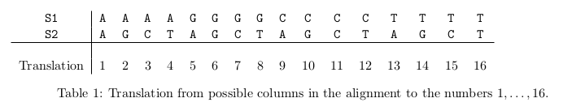
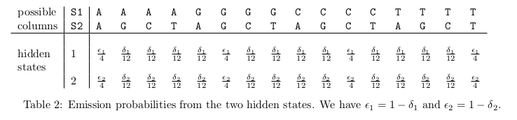

```{r setup, include=FALSE}
knitr::opts_chunk$set(echo = TRUE, comment = NA, highlight = F)
library(tidyverse)
source("ASLMiB_Library.R")
```

# Hidden Markov Model: Project 1
### Advanced Statistical Methods in Bioinformatics
### Asger Hobolth


## 1. Jukes-Cantor model

In the Jukes-Cantor model, the probability p that two nucleotides are different in a genomic
position is given by 
$$p = 1 - I(t) = 3/4(1 - exp(-4t/3))$$
where t is the evolutionary distance (or, more precisely, the expected number of substitutions)
between the two genomes.

a) Show in detail that we can invert the equation to obtain: 
$$t = -\frac{3}{4}log(1 - \frac{4}{3}p)$$
We start with: 
$$p = 1 - I(t) = 3/4(1 - exp(-4t/3))$$
$$\frac{4}{3}p = 1- exp(-4t/3)$$
$$1 - \frac{4}{3}p = exp(-4t/3)$$
$$log(1-3/4p) = -4t/3$$
$$\frac{-3}{4}log(1-\frac{4}{3}p) = t $$

b) Show that t ~= p for small p (use a Taylor expansion), and $t \rightarrow \infty$ for  $p \rightarrow 3/4$. Argue why these two limitating cases make sense. 
Using Taylor expansion:
$$f(x) = f(a) + f'(a)(x-a)$$
In our case, f(x) = t(p). Being p ~ 0:
$$t(0) = \frac{-3}{4}log(1-\frac{4}{3}0) = 0$$
$$t'(p) = \frac{1}{1-\frac{4}{3}p} ; t'(0)=1$$
Into Taylor's expansion:
$$t(p) = t(0)+t'(0)(p - 0)$$
$$t(p)=0+1(p-0)=p$$
$$t(p)=p$$
So we can see that for small numbers, t ~ p.
For $p \rightarrow 3/4$:
$$t(3/4)=\frac{-3}{4}log(1-\frac{4}{3}\frac{3}{4})$$
$$t(3/4) = \infty$$
We can see the higher bound of this equation is 3/4, as if we get higher number we will get a negative expression inside the logarithm, which can't be calculated.

c) The probability of a base pair (nucleotide) position in the human genome being different from the homologous position in the chimpanzee genome is 1.37%, and the substitution rate is $0.5 · 10^-9$ substitutions per base pair per year. What is the average divergence time (in million years) between human and chimpanzee? The difference between human and gorilla is 1.75% and human and orangutan is 3.40%. What is the divergence time between human and gorilla, and human and orangutan?   
\   
Using the equation previously derived, $\frac{-3}{4}log(1-\frac{4}{3}p) = t$, and dividing by two as they are diploid individuals, we can calculate the average divergence time using the next function:   
\   
```{r}
calcAvgT <- function(p, s){
    t <- (-3/4)*log(1-((4/3)*p))
    return(t/s/2)
}
```

```{r echo=F}
s <- 0.5*10^-9
cat("Estimated divergence (human-chimpanzee):", calcAvgT(0.0137, s)/10^6, "million years")
cat("Estimated divergence (human-gorilla):", calcAvgT(0.0175, s)/10^6, "million years")
cat("Estimated divergence (human-orangutan):", calcAvgT(0.0340, s)/10^6, "million years")
```

## 2. Identifying neutral and functional regions (or: Phylogenetic footprinting)   

We investigate two aligned sequences S1 and S2. The sequences are of length L = 293 after
removal of gaps. The first and the last part of the sequences look as follows:

\  

```{r, echo=F, results='asis', }
dat <- dget("PhyloFoot.dat")
S1 <- dat$S1
S2 <- dat$S2

cat("S1:", substring(S1, 0, 10), "...", substring(S1, nchar(S1)-10), "\n\n")
cat("S2:", substring(S2, 0, 10), "...", substring(S2, nchar(S2)-10))
```

\  

We first translate the nucleotide sequences to a numerical vector. We translate A,G,C,T to 1,2,3,4.
The first and the last part of the numerical sequences look as follows:

\  

```{r, echo=F, results='asis'}
S1.num <- as.numeric(strsplit(chartr("AGCT","1234",S1),"")[[1]])
S2.num <- as.numeric(strsplit(chartr("AGCT","1234",S2),"")[[1]])

cat("S1.num:", head(S1.num), "...", tail(S1.num), "\n\n")
cat("S2.num:", head(S2.num), "...", tail(S2.num))
```

\  

There is a total of 16 possible outcomes in each alignment column (4 possible outcomes in S1
times 4 possible outcomes in S2).
We can translate the 16 possible outcomes to the numbers 1, . . . , 16 using the command

```{r, echo = T}
obs.seq <- 4*(S1.num-1)+S2.num
```

The first and last part of obs.seq look as follows:

```{r, echo=F, results='asis'}
cat("obs.seq:", head(obs.seq), "...", tail(obs.seq), "\n")
```

a) Explain that a column with A in S1 and A in S2 is translated to the number 1, while a
column with G in S1 and C in S2 is translated to the number 7. \

Using the given formula, we would obtain the correspondant translated number, which is unique for each different state in S1 and S2. Pluging in into the equation:   
\   
```{r}
4*(1-1)+1 # A correspond to state 1
4*(2-1)+3 # G corresponds to state 2, C correspond to state 3
```
\   

b) Explain that the following vector of length 16 indicates if an alignment column contains similar or different nucleotides:   
`diff.indx <- c(0,1,1,1,1,0,1,1,1,1,0,1,1,1,1,0)`   
\   
We can see that the vector corresponds to Table 1, in which assigns 0 whenever we have columns that contain the same nucleotides, and 1 in the other cases.   
\   
From diff.indx and obs.seq we make a new vector, diff.seq, of the same length as S1 and S2, which indicates if the two nucleotides are the same or not. The R command and the first and last entries in diff.seq are. We find the total number of different columns in the alignment with the command and we get:   
\   
```{r}
diff.indx <- c(0,1,1,1,1,0,1,1,1,1,0,1,1,1,1,0)
diff.seq <- diff.indx[obs.seq]
sum(diff.seq)
```
\   

c) Use the previous exercise to estimate the total number of expected substitutions between the two sequences under the Jukes-Cantor model:   
\   
```{r}
p = 69/293

t <- (-3/4)*log(1-((4/3)*p))

expected_nsubs <- t * 293
cat("Expected nº of substitutions:", expected_nsubs, "*")
```
\   
*_Although we only observe 69. That is because consecutive mutations can revert the nucleotide to the original one, i.e. $A \rightarrow C \rightarrow A$, which won't be noticeable from the sequence.  

We now want to inspect the two sequences in more detail. In particular we want to divide the sequences into two types of regions: Neutrally evolving regions and functional regions. If a region is functional, the number of substitutions is expected to be smaller than if the region is evolving neutrally. In order to divide the sequences into these two types of regions, we formulate a hidden Markov chain with two hidden states. The hidden states correspond to functional regions (state 1) and neutral regions (state 2).      
\   
Let $\delta_1$ be the probability for observing a column with different nucleotides in state 1, and let $\delta_2$ be the probability for different nucleotides in state 2. Furthermore, let $\epsilon_i = 1 - \delta_i (i = 1, 2)$ be the probability for observing a column in state $i$ where the two nucleotides are the same. The emission probabilities are determined from the matrix $b_i(a)$ in Table 2, where $i = 1, 2$ and $a = 1, . . . , 16$.   
\   
 

d) Explain why the emission probabilities sum to 1 within each row:   
\   
Because the emission probability matrix defines, in each row, the probabilities of emiting the different hidden states from a particular observation. As they include all possible states, the probability distribution of these should some up to 1 by definition.   
\   
The transition matrix is determined by the 2 × 2 matrix 
$$ P = \left(\begin{array}{cc} 
p_{11} & p_{12}\\
p_{21} & p_{22}
\end{array}\right)$$
and the initial state is given by $\pi = (1/2, 1/2)$   
\   
We want to estimate the parameters $\theta=(\delta_1,\delta_2,p_{11}, p_{22})$ using the EM-algorithm. Let $O=(O_1,...,O_L)$ be the observed sequence and suppose we know hidden state sequence $Q=(q_1,...,q_L)$     

e) Show that the full likelihood:
$$L(\theta;Q,O) = \pi_{q_1} b_{q_1}(O_1) \prod_{l=2}^{L}(p_{q_{l-1},q_l}b_{q_l}(O_t))$$
is proportional to   
$$L(\theta;Q,O) \space \propto \space p_{11}^{N_{11}} p_{12}^{N_{12}} p_{21}^{N_{21}} p_{22}^{N_{22}}  \delta_{1}^{N_1^\delta} \epsilon_{1}^{N_1^\epsilon} \delta_{2}^{N_2^\delta} \epsilon_{2}^{N_2^\epsilon}$$   
\   
and describe in words the meaning of $N_{ij}$ , $N_i^\delta$ and $N_i^\epsilon$. *Note: Notation for length of sequence has being changed from $l/L$ to $t/T$ for clarity.*   
\   
Full likelihood for Hidden Markov Models is defined with 3 parameters, initial distribution, transition matrix and emission matrix $(\pi, P, b)$. Full likelihood of those three parameters can be defined as: 
$$L(\pi, P, b) = \pi_{q_1} [\prod_{t=1}^{T-1} p_{q_t,q_{t+1}}][\prod_{t=1}^{T}b_{q_t}(O_t)]$$
which we can rewrite as,
$$ = \prod_i[\pi_i^{1(q_1 = i)}][\prod_{i,j}p_{ij}^{N_{ij}}] [\prod_{i,a}b_i(a)^{N_i(a)}]$$
being 
$$N_{ij} = \sum_{t=1}^{T-1} 1(q_t = i, q_{t+1} = j)$$
$$b_i(a) \in [\delta_i, \epsilon_i]$$
$$N_i(a) \in [N^\delta_i, N^\epsilon_i]$$
Or in words:     
\   
\   $N_{ij}$ is the number of times we transition from state i to j.    
\   $N_i^\delta$ is the number of times we observe a column with different nucleotides in state i.   
\   $N_i^\epsilon$ is the number of times we observe a column with equal nucleotides in state i.   
\   
Then, we see that the result of $L(\pi, P, b)$ will be proportional to $p_{11}^{N_{11}} p_{12}^{N_{12}} p_{21}^{N_{21}} p_{22}^{N_{22}}  \delta_{1}^{N_1^\delta} \epsilon_{1}^{N_1^\epsilon} \delta_{2}^{N_2^\delta} \epsilon_{2}^{N_2^\epsilon}$, as in our model we consider $i$ states corresponding to 1 and 2.

f) Describe the M-step in the EM-algorithm (explain the maximization of (1)).    
\   
In the M-step we update existing values of transition and emission matrix based on observed frequencies calculated in E-step. The algorithm is maximizing likelihood of a model given the data in every step since it is slowly updating paramteres of a model, increasing the likelihood in every iteration. In other words, M step (maximization step), maximazes the log likelihood based on the values found in E step (estimation). Expected values are computed by using the following formulas:   
\   
\   $\bar{\pi}_i = \frac{\alpha(1, i)}{P(O)}$ The expected proportion of times in state $S_i$ at first time point, given $O$.   
\   $\bar{p}_{ij} = \frac{E(N_{ij} | {O) }} {\sum_kE(N_{ik} | O)}$,    
\   $\bar{b}_i(a) = \frac{E(N_{i}(a) | {O})} {\sum_aE(N_i(a) | O)}$   
\   

g) Describe what type of calculations are needed for the E-step in the EM-algorithm:   
\   
Speaking in log-likelihood, we can write the full-likelihood formula as:
$$l(\pi,p,b) = \sum_i1(q_1=i) \space log(\pi_i) + \sum_{i,j} N_{ij} \space log(p_{ij}) + \sum_{i,a} N_i(a) \space log(b_i(a))$$
which is the same as saying,
$$= P(q_1 = i | O) + E[N_{ij} | O] + E[N_i(a) | O]$$
Both emission and transition probabilities are drawn from a multinomial distribution so the expected values for them are equivalent to the frequencies. These frequencies are the ones calculated in the E-step of the EM algorithm, and they will later be used to update the estimates of $\bar{\pi}_i, \bar{p}_{ij}, \bar{b}_i(a)$   

We now want to implement the EM-algorithm. We first implement a function, EmissionFct, which returns the matrix in Table 2 as a function of $\delta_1$ and $\delta_2$. Second we activate the function HMMexpectationsFct (previously used in the course). Third we apply the EM algorithm:   
\   
```{r echo=TRUE, results="hide"}
EmsPrbFct <- function(prb.di.1, prb.di.2){
  EmsPrb <- matrix(0,nrow=2,ncol=16)
  for (i in 1:4){ ## (A,G,C,T)
    for (j in 1:4){ ## (A,G,C,T)
      if (i!=j) EmsPrb[1,4*(i-1)+j] <- prb.di.1/12  # 12 possiblities if nucleotides are not the same
      if (i!=j) EmsPrb[2,4*(i-1)+j] <- prb.di.2/12
      if (i==j) EmsPrb[1,4*(i-1)+j] <- (1-prb.di.1)/4 # 4 possiblities if nucleotides are the same
      if (i==j) EmsPrb[2,4*(i-1)+j] <- (1-prb.di.2)/4
    }
  }
  return(EmsPrb)
}

HMMexpectationsFct <- function(InitProb,TransProb,EmisProb,ObsSeq){
  len <- length(ObsSeq)
  nHS <- nrow(TransProb)
  
  # Forward algorithm 
  ## Define ForwardLik matrix
  ForwardLik <- matrix(0,nrow=len,ncol=nHS)
  ## Start condition
  ForwardLik[1,] <- InitProb*EmisProb[,ObsSeq[1]]
  ## Determine ForwardLik by recursion
  for (k in 2:len){
    for (j in 1:nHS){
      ForwardLik[k,j] <- sum(TransProb[,j]*
                             rep(EmisProb[j,ObsSeq[k]],nHS)*
                             ForwardLik[k-1,])
    }
  }
  ForwardLikVal <- sum(ForwardLik[len,])
  cat("Likelihood from Forward algorithm:",ForwardLikVal,"\n")

  # Backward algorithm
  ## Define BackwardLik
  BackwardLik <- matrix(0,nrow=len,ncol=nHS)
  ## Start condition
  BackwardLik[len,] <- rep(1,nHS)
  ## Determine logBackwardLik by recursion
  for (k in (len-1):1){
    for (j in 1:nHS){
      BackwardLik[k,j] <- sum(TransProb[j,1:nHS]*
                              EmisProb[,ObsSeq[k+1]]*
                              BackwardLik[k+1,])
    }
  }
  BackwardLikVal <- sum(InitProb*
                        EmisProb[,ObsSeq[k]]*
                        BackwardLik[1,])
  cat("Likelihood from Backward algorithm:",BackwardLikVal,"\n")

  ## Posterior probability
  PostProb <- exp(log(BackwardLik)+log(ForwardLik)-log(BackwardLikVal))

  ## Expected transition counts
  TransCnt <- matrix(0,nrow=nHS,ncol=nHS)
  for (k in 1:nHS){
    for (l in 1:nHS){
      Probkl <- ForwardLik[1:(len-1),k]*BackwardLik[2:len,l]/
        BackwardLikVal*TransProb[k,l]*EmisProb[l,ObsSeq[2:len]]
      TransCnt[k,l] <- sum(Probkl)
    }
  }
  output <- list()
  output$TransCnt <- TransCnt
  output$PostProb <- PostProb
  output$Lk <- BackwardLikVal
  return(output)
}

## EM algorithm -------------------------------------------------------
## Specify initial parameter values
IntPrb <- c(1/2,1/2)
TrnsPrb <- matrix(c(0.8,0.2,
                    0.1,0.9),byrow=TRUE,nrow=2,ncol=2)
prb.di.1 <- 0.2
prb.di.2 <- 0.4
EmsPrb <- EmsPrbFct(prb.di.1,prb.di.2)

## Number of iterations
nIter <- 20
for (iter in 1:nIter){
    cat("--------------------------------------","\n")
    HMMexpct <- HMMexpectationsFct(IntPrb,TrnsPrb,EmsPrb,obs.seq)
    cat("\n")
    cat("Iteration:",iter,"log-likelihood:",log(HMMexpct$Lk),"\n")
    TrnsPrb <- HMMexpct$TransCnt/rowSums(HMMexpct$TransCnt)
    cat("Updated transition probability matrix:","\n")
    print(TrnsPrb)
    N.di.1 <- sum(HMMexpct$PostProb[,1]*diff.seq)
    N.sa.1 <- sum(HMMexpct$PostProb[,1]*(1-diff.seq))
    N.di.2 <- sum(HMMexpct$PostProb[,2]*diff.seq)
    N.sa.2 <- sum(HMMexpct$PostProb[,2]*(1-diff.seq))
    cat("Updated emission probabilities:","\n")
    cat(prb.di.1,prb.di.2,"\n")
    prb.di.1 <- N.di.1/(N.di.1+N.sa.1)
    prb.di.2 <- N.di.2/(N.di.2+N.sa.2)
    EmsPrb <- EmsPrbFct(prb.di.1,prb.di.2)
}
```
\   

h) Explain the R program above.   
\   
The emission probability function `EmsPrbFct`, simply calculates Table 2. Getting the $\delta$ corresponding with each state (1 and 2) devides by 12 when they are not equal and the opposite probability by 4 when they are equal. Using this equation we will obtain the Emission Probability matrix for our model. `HMMexpectationsFct` is an implementation for the forward and backward algorithm in which prints the likelihood for both algorithms and returns posterior probability as well as the expected transition counts. These calculated results (E-step) are used to update the Transition and Emission probabilities (M-step) in the last chunk of code. The Initial Probability vector, Transition Matrix and Emission Matrix are defined with the initial parameters (which will be updated), then there is a for loop with defined number of iterations (20). In this for loop we integrate forward-backward algoritms with EM-function. The `HMMexpectationsFct` (explained before) would represent the E-step, while the following calculations (updating transition and emission probabilities) would represent the M-step. 
\  
After 20 iterations the parameter estimates are    
\   
$$\theta = (\bar\delta_1, \bar\delta_2, \bar{p}_{11}, \bar{p}_{22}) = (0.12,0.34,0.84,0.86)$$   
\   
i) What is the expected number of substitutions between the two sequences under the hidden Markov model?   
\   
Under the hidden Markov model, we can calculate the expected number of substitutions using the next expression:   
$$ n_{11} \space \delta_1 + n_{12} \space \delta_1 + n_{21} \delta_2 + n_{22} \space \delta_2$$
Meaning that we can estimate the expected number of substitutions with the expected number of transitions (`TransCnt` matrix) and the probability for observing a different nucleotide in the different states ($\delta_1$ and $\delta_2$):   
\   
```{r echo=F}
n_subs <- (HMMexpct$TransCnt[1,1] * prb.di.1) + (HMMexpct$TransCnt[1,2] * prb.di.2) + 
            (HMMexpct$TransCnt[2,1] * prb.di.1) + (HMMexpct$TransCnt[2,2] * prb.di.2) 
```

```{r echo=F}
cat("Number of expected substitutions:", n_subs)
```
\   

j) Decode the sequence alignment using:
\  
- the Viterbi algorithm:
\   
```{r}
viterbi <- calcViterbi(initProb = IntPrb, transProb = TrnsPrb, 
                       emissionProb = EmsPrb, obsSeq = obs.seq)

decoded_viterbi <- viterbi$backtrack

```
\   

- posterior decoding:  
\   
```{r}
posterior <- forwardBackward(InitProb = IntPrb, TransProb = TrnsPrb, 
                             EmisProb = EmsPrb, ObsSeq =obs.seq)

decoded_posterior <- max.col(posterior$PostProb)
```
\   
Make a plot that summarizes the data and corresponding decoding. Do the regions with few differences correspond to predicted functional regions? 
\   
```{r echo=F}
df <- data.frame(observed = diff.seq + 1, viterbi = decoded_viterbi, posterior = decoded_posterior)

Ln <- length(obs.seq)
par(mfrow=c(2,1))
# plot(1:Ln, df$observed,
#      col="black",type="l",
#      main="Observed sequence",
#      xlab="sequence index",ylab="Observed state", ylim = range(1:2))

plot(1:Ln, df$viterbi,
     col="blue",type="l",
     main="Viterbi sequence",
     xlab="sequence index",ylab="Decoded state",ylim = range(1:2))

plot(1:Ln, df$posterior,
     col="red",type="l",
     main="Posterior sequence",
     xlab="sequence index",ylab="Decoded state",ylim = range(1:2))
```

State 1 was defined as functionally important and state 2 as neutrally evolving in the given code. Taking this into account, it seems like the functional regions (3 regions in the viterbi sequence) are less different compared to the posterior sequence. In the theorically intergenic regions, the differences in the decoded function is more noticeable.   
\   
In our case of study I would prefer to use viterbi, as it represent better how the genome is structure: gene "islands" between long intergenic regions. The transitions described by the posterior sequence are far from realistic applied to a DNA sequence.

