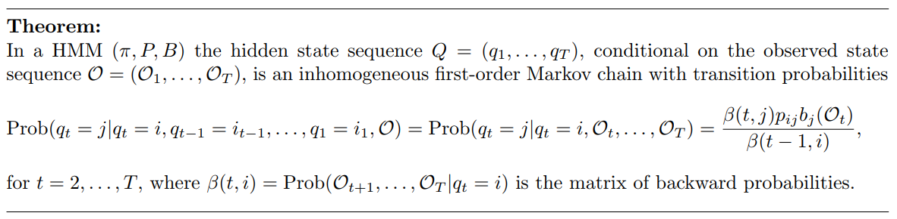
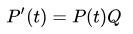

```{r setup, include=FALSE}
knitr::opts_chunk$set(echo = FALSE, comment = NA)
library(tidyverse)
source("ASLMiB_Library.R")
```

# Poisson and Posterior HMM analysis
### Advanced Statistical Methods in Bioinformatics
### Asger Hobolth

# Project description

Recall the fetal lamb movement data from Handout 5. We model the data using a HMM with two hidden states corresponding to low activity (state 1) and high activity (state 2). The transition matrix for the hidden states is then determined by the probability for staying in the low activity state $a = p_{11}$ and the probability for staying in the high activity state $b = p_{22}$. Furthermore we let the initial distribution be $\pi$ = (1/2, 1/2). The number of movements in the low activity state follows a Poisson distribution with rate $\lambda_1$ and the number of movements in the high activity state is assumed Poisson with rate $\lambda_2$. We use the notation from Ewens and Grant (2005) Section 12, where $O = (O_1, . . . , O_T)$ is the observed data and $Q = (q_1, . . . , q_T)$ is the hidden state sequence

```{r}
# Fetal lamb movement from Handout 5
ObsSeq <- c(0,0,0,0,0,1,0,1,0,0,0,0,0,0,1,
            0,1,0,0,0,0,2,2,0,0,0,0,1,0,0,
            1,1,0,0,1,1,1,0,0,1,0,0,0,0,0,
            0,0,0,0,0,0,0,0,0,0,0,0,0,2,0,
            1,0,0,0,0,0,0,0,0,0,0,0,0,0,0,
            0,0,0,1,0,0,0,0,0,7,3,2,3,2,4,
            0,0,0,0,1,0,0,0,0,0,0,0,1,0,2,
            0,0,0,0,1,0,0,0,0,1,0,0,0,0,0,
            0,0,0,0,0,0,0,0,0,1,0,0,0,0,0,
            2,1,0,0,1,0,0,0,1,0,1,1,0,0,0,
            1,0,0,1,0,0,0,1,2,0,0,0,1,0,1,
            1,0,1,0,0,2,0,1,2,1,1,2,1,0,1,
            1,0,0,1,1,0,0,0,1,1,1,0,4,0,0,
            2,0,0,0,0,0,0,0,0,0,0,0,0,0,0,
            0,0,0,0,0,0,0,0,0,0,0,0,0,0,0)
```

####1. Determine the maximum likelihood estimates of the four parameters ($a, b, \lambda_1, \lambda_2$) using the EM-algorithm. Derive and describe the EM-algorithm in detail.

In order to estimate $a$ and $b$ we can reference the derivation done in Hand-in 1 in which we defined the estimated transition matrix elements, $p_{ij}$ as

$$\bar{p}_{ij} = \frac{E(N_{ij} | {O) }} {\sum_kE(N_{ik} | O)}$$

meaning that we update our transition matrix based on the observed sequence element $O_i$ and the transition counts between states $i$ and $j$ (looking at position $t-1$). In our case, we are interested on estimating the values $p_{11} = a$ and $p_{22} = b$. One difference we have to take into account is that we are now working with poisson distribution for the emission probabilities.

For the estimation of $\lambda_1, \lambda_2$ we know that given our observed sequence $O(O_1, ..., O_T)$ and two possible states $i=1$ (low activity) and $i=2$ (high activity). We would have a hidden state sequence $Q(q_1, ..., q_T)$ that follows:

$$P(q=1) \sim Poisson(\lambda_1), \space \space \space \space \space \space P(q=2) \sim Poisson(\lambda_2)$$
Let $O^i$ be the observations emitted by state $i = 1, 2$ and $T_iS$ the nº of observations emitted in state $i=1, 2$. Then our likelihood for each of the $\lambda_i$ would be,

$$L(\lambda_i, O^i, Q) = \prod^{T_i}_{t=1} e^{-\lambda_i}\frac{\lambda_i^{O^i_t}}{O^i_t!}$$
$$l(\lambda_i, O^i, Q) = \ln( \prod^{T_i}_{t=1} e^{-\lambda_i}\frac{\lambda_i^{O^i_t}}{O^i_t!})$$

$$l(\lambda_i, O^i, Q) = \lambda_iT_i - \sum^{T_i}_{t=1} ln(O^i_t !) + ln(\lambda_i) \sum^{T_i}_{t=1} O^i_t$$
which deriving and setting equal to zero let us resolve:

$$\lambda_i = \frac{\sum^T_{t=1} O_t}{T}$$

At this point we have our expectation for $\lambda_i$ which we will update according to,

$$\hat\lambda_i = \mathbb{E}\Bigg[\frac{\sum^T_{t=1} O_t}{T}\Bigg] = \frac{\sum^T_{t=1} O_t \mathbb{P}(q_t = i | O)}{\sum^T_{t=1} \mathbb{P}(q_t = i | O)}$$

The EM-algorithm is implemented in a function `hmmEMpois` explained in the Appendix. The initial values are $(a, b, \lambda_1, \lambda_2) = (0.5, 0.6, 1, 3)$ and the estimated values after the EM-algorithm are:

```{r}
## Starting values
lambda1Est <- 1 ; lambda2Est <- 3 ; a <- 0.5 ; b <- 0.6
InitTrans <- matrix(c(a, 1-a,
                      1-b, b),byrow=TRUE,nrow=2)

## Number of iterations
nIter <- 1000  # maximum number of iterations

EMres <- hmmEMpois(InitProb = c(0.5, 0.5), InitTrans = InitTrans, 
                   Lambda = c(lambda1Est, lambda2Est), ObsSeq = ObsSeq)
```

```{r echo=FALSE}
cat("\ta", " \t\tb", "\t\tLambda1", "\tLambda2", "\n", 
    EMres$transProb[1,1], EMres$transProb[2,2], EMres$lambda1, EMres$lambda2, sep = '\t')
```

####2. Determine the Viterbi and Posterior Decoding state sequences.

We get Viterbi decoding sequence from the observed data, using the estimated transition matrix, $\lambda_1$ and $\lambda_2$ as parameters for the model. Then we use the forward-backward algorithm with the same parameters in order to obtain the posterior decoding sequence. We compare these two decoded sequences to the fetal lamb movement observation:

```{r}
ViterbiRes <- ViterbiPoisFct(InitProb = c(0.5,0.5), TransProb = EMres$transProb, 
                             Lambda = c(EMres$lambda1, EMres$lambda2), ObsSeq = ObsSeq)

hmmPoisExp <- HMMPoisExpectationsFct(InitProb=c(0.5,0.5), TransProb=EMres$transProb,
                                     Lambda=c(EMres$lambda1, EMres$lambda2),
                                     ObsSeq=ObsSeq)

## Visualize result
Ln <- length(ObsSeq)
par(mfrow=c(3,1))
plot(1:Ln,ObsSeq,
     col="blue",type="l",
     main="Observed sequence",
     xlab="sequence index",ylab="Observed state")
plot(1:Ln,ViterbiRes$BackTrack,
     col="red",type="l",
     main="Viterbi decoding",
     xlab="sequence index",ylab="Decoded state")
plot(1:Ln, hmmPoisExp$PostDecode,
     col="darkgreen",type="l",
     main="Posterior decoding",
     xlab="sequence index",ylab="Observed state")
```

Both viterbi and posterior decoding show the same sequence, mostly low activity state (1) and high activity state (2) concurring with the higher values on the observed sequence.

####3. In the following the parameters are fixed at their maximum likelihood estimates and assumed known. Calculate the posterior transition probabilities 
$a_t = Prob(q_t = 1 | q_{t-1} = 1, O)$ and $b_t = Prob(q_t = 2|q_{t-1} = 2, O)$ for $t = 2, . . . , T$.

We will for now on work with the estimated transition probability matrix, as well as the corresponding $\lambda$ values of the poisson distributions for the emission probability matrix. In order to calculate the posterior transition probabilities $a_t$ and $b_t$, we need to apply the theorem shown in lectures:



Meaning that we need the backward probabilities (calculated in previous question) in position $t$ and $t-1$ as well as the transition and emission probabilities. As we are calculating $Prob(q_t = 1 | q_{t-1} = 1, O)$ and $Prob(q_t = 2|q_{t-1} = 2, O)$ we only care about the transition probabilities for remaining in a given state a.k.a. $p_{11} \rightarrow a_t$ and $p_{22} \rightarrow b_t$ position in the transition matrix.

```{r}
a <- EMres$transProb[1,1]
b <- EMres$transProb[2,2]

# Emission Probabilities
Emissions_state1 <- dpois(ObsSeq, EMres$lambda1)
Emissions_state2 <- dpois(ObsSeq, EMres$lambda2)

# Likelihood Probabilities in each position
BackProbs <- hmmPoisExp$Lks

Len <- length(ObsSeq)

# Formula in theorem of the PosteriorHMMAnalysis.pdf
p11 <- (BackProbs[2:Len, 1] * a * Emissions_state1[2:Len]) / BackProbs[1:Len-1, 1]
p22 <- (BackProbs[2:Len, 2] * b * Emissions_state2[2:Len]) / BackProbs[1:Len-1, 2]
```

####4. Plot the transition probabilities a = (a 2 , . . . , a T ) and b = (b 2 , . . . , b T ) and the original data. Discuss the plots: Do the posterior transition probabilities behave as expected?

```{r}
## Visualize result
Ln <- length(ObsSeq)
par(mfrow=c(3,1))

plot(2:Ln,p11,
     col="red",type="l",
     main="a",
     xlab="t",ylab="Probabilities")
plot(1:Ln,ObsSeq,
     col="blue",type="l",
     main="Observed sequence",
     xlab="sequence index",ylab="Observed state")
plot(2:Ln,p22,
     col="darkgreen",type="l",
     main="b",
     xlab="t",ylab="Probabilities")
```

We can see in the plots that $a_t$ has a very high probability except in the high-value peaks of the observed data, same as it is shown in viterbi decoding. This is expected as during most of the observed sequence there is low activity and the posterior transition probability of remaining in this state increases. Also as expected, $b_t$ shows a somehow opposite pattern, but also more variable. One noticeable pattern is how $b_t$ posterior transition probabilities follow the pattern seen in the observed data. We can also see how when $a_t$ probabilities are low, $b_t$ probabilities are close to 1, something that we can see reflected in the viterbi/posterior decoding. In conclusion, posterior transition probabilities of remaining in state 1, $a_t$, should be higher when we observe regions with low activity and $b_t$ should be higher when we observe region with high activity.

####5. What is the posterior probability of the Viterbi sequence? Do you find that the Viterbi sequence is a good representative for the posterior distribution of hidden state sequences?

We can again compare the viterbi sequence and it's posterior probability in $t$ to the observed data to confirm that the viterbi sequence is a good representative for the posterior ditribution of the hidden state sequence (stays in low activity except two peaks of high activity).

```{r}
EmisPrb <- matrix(c(dpois(0:7, EMres$lambda1), 
                    dpois(0:7, EMres$lambda2)), nrow = 2, byrow = T)

fbRes <- forwardBackward(InitProb = c(0.5,0.5), TransProb = EMres$transProb, 
                         EmisProb = EMres$emisPrb, ObsSeq = ViterbiRes$BackTrack)

par(mfrow=c(3,1))
plot(1:Ln,ObsSeq,
     col="blue",type="l",
     main="Observed sequence",
     xlab="sequence index",ylab="Observed state")
plot(1:Ln,ViterbiRes$BackTrack,
     col="red",type="l",
     main="Viterbi decoding",
     xlab="sequence index",ylab="Decoded state")
plot(1:Ln, fbRes$PostProb[,1],
     col="darkgreen",type="l",
     main="PostProb",
     xlab="b",ylab="Probabilities")
```


####6. Describe and implement a procedure for simulating a hidden state sequence from the posterior distribution.

We can simulate a hidden state sequence from the estimated values for the posterior distribution by sampling with the correspondant probabilities:

- For the first position we sample based on our initial probabilities ($\pi = (0.5, 0.5)$)
- For the next positions we use the posterior transition probabilities in $t$.
    - if we are in state 1 we will use probabilities in the first row
    - if we are in state 2 we will use probabilities in the second row
    
$$\left(\begin{array}
{cc}
    a_t & 1-a_t\\
    1-b_t & b_t
\end{array}\right)$$


```{r}
simHMM <- HMMsimFct(InitProb = c(0.5,0.5), p11 = p11, p22 = p22)
```


####7. Calculate the empirical distribution (from a reasonable number of simulations) of the fraction of time, the fetal lamb is in the high activity state.

We can calculate the distribution by using the simulation method described above multiple times and in each time getting the fraction of states 2 we encounter.

```{r}
empDistr <- replicate(5000, expr = {
    simHMM <- HMMsimFct(InitProb = c(0.5,0.5), p11 = p11, p22 = p22)
    sum(simHMM$HidSeq == 2) / Len
})

hist(empDistr)
mean(empDistr)
```


####8. Supply the empirical distribution with a numerical calculation of the distribution. Plot the two distributions and add the fraction from Viterbi and Posterior Decoding.

A numerical calculation of the distribution can be done by using Hidden Markov Chain Embedding: 



Being $Q$ our initial probabilities.

```{r}
library(expm)

# To do the numerical approach we should use a matrix of form:
# | 0 1-bt bt 0 0 ... 0 |
# | 0 at 1-at 0 0 ... 0 |
# | 0 0 1-bt bt 0 ... 0 |
# |      ...            |    
# | 0 0 0 0 0 0 0 ... 1 |

numEmpDistr <- rep(0, 5000)
for (i in 1:1000) {
    transMatInT <- EMres$transProb %^% i
    numEmpDistr[i] <- c(0.5, 0.5) %*% transMatInT %*% c(0,1)  # We are interested in state 2
}

viterbiFrac <- sum(ViterbiRes$BackTrack == 2) / Len
posteriorFrac <- sum(hmmPoisExp$PostDecode == 2) / Len

par(mfrow=c(2,1))

hist(empDistr, main = "Simulation approach", xlim = c(0, 0.08))
abline(v=mean(empDistr))
abline(v=viterbiFrac,col="red")
abline(v=posteriorFrac,col="blue")

hist(numEmpDistr, main = "Numerical approach", xlim = c(0, 0.08))
abline(v=mean(numEmpDistr))
abline(v=viterbiFrac,col="red")
abline(v=posteriorFrac,col="blue")
```


####9. Do you prefer the simulation-based or the numerical procedure for calculating the fraction of time spent in the high activity state? Why?

Although simulation takes more time to compute, according to the results, the simulation based approach gives a more defined distribution as $P(t)$ in the numerical approach comes to an stationary distribution where it doesn't change anymore.

####10. What is the role of parameter uncertainty? Clearly, the original parameters (a, b, lambda_1, lambda_2) are estimated with some uncertainty. But does that matter for the distribution of the fraction of time spent in a state?

Although the parameter uncertainty can affect the value of the time spent in a state, it should not affect the distribution of the fraction of time spent in a state.

####11. We finally consider three statements in Aston and Martin (2007); the full paper is available on BlackBoard.

Discuss the three paragraphs in relation to your analysis of the fetal lamb movement data.

a) Basically they discuss how obtaining the posterior distribution is more helful and reliable to make good estimates of, p.e. the number of genes present in a DNA sequence. This matches what we have seen, in our case with the fraction of time spent in high activity. 
b) In this paragraph they mentioned a disadvantage of the simulated approach like the one we presented in question 7, mainly about the longer and inhomogeneous computation time as well as the fact that we get an approximate distribution. This can be seen when we perform the two approaches with the same number of iterations, being the simulated approach slower.
c) Finally, they discuss about the effect of an error in the estimation of the parameters ($a, b, \lambda_1, \lambda_2$, in our case) for the final distribution. During the process of this project, I could see how the values of these 4 parameters changed enormously the results. One of the key factors was to have a sufficient amount of iterations/strict stopping criteria for the EM-algorithm to converge. This is something it will be worth exploring in detail.

# Appendix

```{r echo = T}
# EM implementation on HMM parameters estimation
# Outputs the updated emission, transition probabilities + lambda1 + lambda2
hmmEMpois <- function(InitProb=c(0.5,0.5), InitTrans, Lambda, ObsSeq, nIter=100){ 
    EstTransMatrix <- NULL
    poisEM <- matrix(0,nrow = 2, ncol = 8)
    for(i in 1:nIter){
        if (i == 1) {
            # Initialization
            hmmPoisExp <- HMMPoisExpectationsFct(InitProb=InitProb, 
                                                 TransProb=InitTrans,
                                                 Lambda=Lambda,
                                                 ObsSeq=ObsSeq)
            EstTransMatrix <- hmmPoisExp$TransPrb
        } else {
            # Updating transition matrix
            hmmPoisExp <- HMMPoisExpectationsFct(InitProb=c(0.5,0.5),
                                                 TransProb=EstTransMatrix,
                                                 Lambda=c(lambda1, 
                                                          lambda2),ObsSeq=ObsSeq)
            EstTransMatrix <- hmmPoisExp$TransPrb
        }
        
        # Updating lambda values
        lambda1 <- sum(hmmPoisExp$PostProb[,1]*ObsSeq/sum(hmmPoisExp$PostProb[,1]))
        lambda2 <- sum(hmmPoisExp$PostProb[,2]*ObsSeq/sum(hmmPoisExp$PostProb[,2]))
        #cat("Updated emission probabilities:","\n")
        #cat(lambda1,lambda2,"\n")
        lb <- c(lambda1, lambda2)
        for(i in 0:7){
            for(j in 1:2){
                # Updating the emission probabilities based on the updated lambdas
                poisEM[j,(i+1)]<-dpois(i, lambda =lb[j] )
            }
        }
        
    }
    out <- list(emisPrb = poisEM, transProb = EstTransMatrix,
                lambda1 = lambda1, lambda2 = lambda2)
    return(out)
}

# Viterbi implementation for poisson distributed emissions
# Gets viterbi decoding
ViterbiPoisFct <- function(InitProb,TransProb,Lambda,ObsSeq){
    Len <- length(ObsSeq)
    nHS <- nrow(TransProb)
    ## Define MaxValue and MaxArrow
    MaxValue <- matrix(0,nrow=Len,ncol=nHS)
    MaxArrow <- matrix(0,nrow=Len,ncol=nHS)
    ## Initialization
    MaxValue[1,] <- InitProb*dpois(ObsSeq[1],Lambda)
    ## Determine MaxValue and MaxArrow by recursion
    for (k in 2:Len){
        for (j in 1:nHS){
            Val <- TransProb[,j]*
                rep(dpois(ObsSeq[k],Lambda[j]),nHS)*
                MaxValue[k-1,]
            MaxValue[k,j] <- max(Val)
            MaxArrow[k,j] <- which.max(Val)
        }
    }  
    ## Backtrack 
    BackTrack <- rep(0,Len)
    BackTrack[Len] <- which.max(MaxValue[Len,])
    for (i in Len:2) {
        BackTrack[i-1] <- MaxArrow[i,BackTrack[i]]
    }
    out <- list()
    out$BackTrack <- BackTrack
    out$MaxValue <- MaxValue
    out$MaxArrow <- MaxArrow
    return(out)
}

# Update of Transition counts / transition probabilities calculating the
# posterior probability by doing the forward-backward algorithm
HMMPoisExpectationsFct <- function(InitProb,TransProb,Lambda,ObsSeq){
    len <- length(ObsSeq)
    nHS <- nrow(TransProb)
    #-------------------
    # Forward algorithm 
    #-------------------
    # Define ForwardLik matrix
    ForwardLik <- matrix(0,nrow=len,ncol=nHS)
    # Start condition
    ForwardLik[1,] <- InitProb*dpois(ObsSeq[1],Lambda)
    # Determine ForwardLik by recursion
    for (k in 2:len){
        for (j in 1:nHS){
            ForwardLik[k,j] <- dpois(ObsSeq[k],Lambda[j]) *
                sum(TransProb[,j] * ForwardLik[k-1,])
        }
    }
    ForwardLikVal <- sum(ForwardLik[len,])
    #cat("Likelihood from Forward algorithm:",ForwardLikVal,"\n")
    #--------------------
    # Backward algorithm
    #--------------------
    # Define BackwardLik
    BackwardLik <- matrix(0,nrow=len,ncol=nHS)
    # Start condition
    BackwardLik[len,] <- rep(1,nHS)
    # Determine logBackwardLik by recursion
    for (k in (len-1):1){
        for (j in 1:nHS){
            BackwardLik[k,j] <- sum(TransProb[j,1:nHS]*
                                        dpois(ObsSeq[k+1], Lambda)*  
                                        BackwardLik[k+1,])
        }
    }
    BackwardLikVal <- sum(InitProb*
                              dpois(ObsSeq[k],Lambda)*
                              BackwardLik[1,])
    #cat("Likelihood from Backward algorithm:",BackwardLikVal,"\n")
    ##-----------------------
    ## Posterior probability
    ##-----------------------
    PostProb <- exp(log(BackwardLik)+log(ForwardLik) - log(BackwardLikVal))
    ##----------------------------
    ## Expected transition counts
    ##----------------------------
    TransCnt <- matrix(0,nrow=nHS,ncol=nHS)
    for (k in 1:nHS){
        for (l in 1:nHS){
            Probkl <- ForwardLik[1:(len-1),k]*BackwardLik[2:len,l]/
                BackwardLikVal * TransProb[k,l] * dpois(ObsSeq[2:len],Lambda[l])
            TransCnt[k,l] <- sum(Probkl)
        }
    }
    output <- list()
    output$TransCnt <- TransCnt
    output$TransPrb <- TransCnt / rowSums(TransCnt)
    output$PostProb <- PostProb
    output$PostDecode <- max.col(PostProb)
    output$Lk <- BackwardLikVal
    output$Lks <- BackwardLik
    output$TransPrb
    return(output)
}

# Simulates sequence of hidden states for our problem
# Inputing the initial probabilities and the posterior transition probabilities,
# we obtain a simulated hidden states sequence of length T
HMMsimFct <- function(InitProb, p11, p22){
    len = length(p11) # T
    nHS = length(InitProb)
    HidSeq <- rep(0,len)
    HidSeq[1] <- sample(1:nHS,size=1,replace=TRUE, InitProb)

    for (i in 2:len){
        
        if (HidSeq[i-1] == 1) {
            # Transition probabilities used from state 1
            HidSeq[i] <- sample(1:nHS, size=1, replace=TRUE, prob = c(p11[i], 1-p11[i]))
        }else{
            # Transition probabilities used from state 2
            HidSeq[i] <- sample(1:nHS, size=1,replace=TRUE, prob = c(1-p22[i], p22[i]))
        }
    }
    Sim <- list()
    Sim$HidSeq <- HidSeq
    return(Sim)
}
```


